```mermaid
%%{init: {'theme': 'base', 'themeVariables': {'primaryColor': '#FF5722', 'primaryTextColor': '#fff', 'primaryBorderColor': '#E64A19', 'lineColor': '#FF9800', 'secondaryColor': '#FFF3E0', 'tertiaryColor': '#FFCCBC'}}}%%

graph LR
    A["🎯 <b>Khám phá</b><br/>Lắng nghe · Phân tích<br/>Xác định mục tiêu"] --> B["📐 <b>Thiết kế</b><br/>UI/UX · Prototype<br/>Kiến trúc hệ thống"]
    B --> C["⚡ <b>Phát triển</b><br/>Agile Sprint<br/>Code Review · CI/CD"]
    C --> D["🔬 <b>Kiểm thử</b><br/>Unit · Integration<br/>UAT · Performance"]
    D --> E["🚀 <b>Triển khai</b><br/>Staging → Production<br/>Monitoring · Analytics"]
    E --> F["🛡️ <b>Đồng hành</b><br/>Bảo trì · Nâng cấp<br/>Hỗ trợ 24/7"]

    style A fill:#FF5722,stroke:#E64A19,color:#fff,stroke-width:2px
    style B fill:#FF7043,stroke:#E64A19,color:#fff,stroke-width:2px
    style C fill:#FF8A65,stroke:#E64A19,color:#fff,stroke-width:2px
    style D fill:#FF9800,stroke:#F57C00,color:#fff,stroke-width:2px
    style E fill:#FFB74D,stroke:#F57C00,color:#333,stroke-width:2px
    style F fill:#FFC107,stroke:#FFA000,color:#333,stroke-width:2px
```

<!-- ═══════════════════════════════════════════════════════════════════════ -->
<!-- 🏢 ZIRATECH DIGITAL SOLUTIONS — GITHUB ORGANIZATION PROFILE          -->
<!-- ═══════════════════════════════════════════════════════════════════════ -->

<!-- ╔══════════════ HEADER BANNER ══════════════╗ -->

  

<!-- ╔══════════════ LOGO & SLOGAN ══════════════╗ -->

   
  
    

  <!-- Animated Typing Effect -->
  
  
   

  <!-- Quick Info Badges -->
  
  &nbsp;
  
  &nbsp;
  

 

<!-- ╔══════════════ WAVE DIVIDER ══════════════╗ -->

 

<!-- ╔══════════════ ABOUT US ══════════════╗ -->
<h2 align="center">🏛️ Chúng tôi là ai?</h2>

  <table>
    <tr>
      <td width="600">
         
        
<b>ZIRATECH DIGITAL SOLUTIONS COMPANY LIMITED</b>

        

          <b>ZIRATECH</b> là công ty công nghệ trẻ tại TP. Hồ Chí Minh, chuyên phát triển phần mềm, ứng dụng di động và các giải pháp số cho doanh nghiệp cũng như khách hàng cá nhân. Chúng tôi đồng thời xây dựng các sản phẩm công nghệ riêng để đưa ra thị trường và chia sẻ mã nguồn chất lượng cho cộng đồng developer.
        

        

          Với đội ngũ đam mê và thực chiến, ZIRATECH đặt trọng tâm vào việc <b><i>hiểu đúng bài toán của khách hàng, giao đúng sản phẩm họ cần — đúng hẹn và trong ngân sách.</i></b>
        

         
      </td>
    </tr>
  </table>

 

<!-- ╔══════════════ MISSION & VISION ══════════════╗ -->
<h2 align="center">🎯 Sứ mệnh & Tầm nhìn</h2>

  <table>
    <tr>
      <td align="center" width="45%">
          
        <h3>🔥 Sứ mệnh</h3>
         
        
<i>"Giúp các doanh nghiệp Việt tiếp cận công nghệ phần mềm chất lượng với chi phí hợp lý, đồng thời đóng góp mã nguồn và công cụ hữu ích cho cộng đồng lập trình viên."</i>

          
      </td>
      <td width="10%"></td>
      <td align="center" width="45%">
          
        <h3>🔭 Tầm nhìn</h3>
         
        
<i>"Trở thành đối tác công nghệ đáng tin cậy mà doanh nghiệp nghĩ đến đầu tiên khi cần số hóa — xây dựng uy tín bằng sản phẩm thực tế và sự đồng hành dài hạn."</i>

          
      </td>
    </tr>
  </table>

 

<!-- ╔══════════════ CORE VALUES ══════════════╗ -->

  
  &nbsp;
  
  &nbsp;
  
  &nbsp;
  

 

 

<!-- ╔══════════════ WHAT WE DO ══════════════╗ -->
<h2 align="center">🚀 Năng lực & Dịch vụ</h2>

  <table>
    <tr>
      <td align="center" width="25%">
         
        
          
        <b>Giải pháp Phần mềm</b>
         
        Thiết kế kiến trúc, phát triển hệ thống ERP, CRM, và các nền tảng quản trị doanh nghiệp theo yêu cầu riêng biệt.
          
      </td>
      <td align="center" width="25%">
         
        
          
        <b>Ứng dụng Di động</b>
         
        Xây dựng app iOS & Android với trải nghiệm mượt mà, hiệu năng vượt trội — từ MVP đến sản phẩm hoàn chỉnh.
          
      </td>
      <td align="center" width="25%">
         
        
          
        <b>Website & Nền tảng số</b>
         
        Landing page, thương mại điện tử, hệ thống SaaS — giao diện tinh tế, tối ưu SEO và tốc độ tải trang.
          
      </td>
      <td align="center" width="25%">
         
        
          
        <b>Mã nguồn & Sản phẩm số</b>
         
        Đóng góp mã nguồn mở cho cộng đồng, thương mại hóa các template, plugin và công cụ phát triển.
          
      </td>
    </tr>
  </table>

 

 

<!-- ╔══════════════ TECH STACK ══════════════╗ -->
<h2 align="center">🛠️ Hệ sinh thái Công nghệ</h2>

  <h4>⚡ Frontend</h4>
  
    
  <h4>🔧 Backend & Database</h4>
  
    
  <h4>☁️ DevOps & Cloud</h4>
  
    
  <h4>🧰 Công cụ & Hệ thống</h4>
  

 

 

<!-- ╔══════════════ WORKING PROCESS ══════════════╗ -->
<h2 align="center">⚙️ Quy trình Vận hành Dự án</h2>

  <i>Mỗi sản phẩm của ZIRATECH đều trải qua quy trình 6 bước nghiêm ngặt — đảm bảo chất lượng từ dòng code đầu tiên đến ngày bàn giao.</i>

 

 

 

<!-- ╔══════════════ CORE TEAM ══════════════╗ -->
<h2 align="center">👥 Đội ngũ Sáng lập</h2>

  <i>Những con người tài năng đứng sau mỗi dòng code và mỗi giải pháp đột phá.</i>

 

  <table>
    <tr>
      <td align="center" width="33%">
        
         
        <b>Lê Minh Trí</b>
         
        Co-Founder
      </td>
      <td align="center" width="33%">
        
         
        <b>Lâm Hoàng An</b>
         
        Co-Founder
      </td>
      <td align="center" width="33%">
        
         
        <b>Ngô Ngọc Gia Hân</b>
         
        Co-Founder
      </td>
    </tr>
  </table>

 

 

<!-- ╔══════════════ WHY CHOOSE US ══════════════╗ -->
<h2 align="center">💎 Tại sao chọn ZIRATECH?</h2>

  <table>
    <tr>
      <td align="center" width="30%">
          
        <h3>⚡ Tốc độ</h3>
         
        
Triển khai nhanh chóng với quy trình Agile — từ ý tưởng đến MVP trong thời gian kỷ lục.

          
      </td>
      <td width="5%"></td>
      <td align="center" width="30%">
          
        <h3>🎨 Tinh tế</h3>
         
        
Mỗi pixel đều có ý nghĩa. Giao diện không chỉ đẹp mà còn tối ưu trải nghiệm người dùng.

          
      </td>
      <td width="5%"></td>
      <td align="center" width="30%">
          
        <h3>🔒 Tin cậy</h3>
         
        
Kiến trúc bảo mật, code sạch, tài liệu minh bạch — bàn giao toàn bộ quyền sở hữu.

          
      </td>
    </tr>
  </table>

 

 

<!-- ╔══════════════ CONTACT ══════════════╗ -->
<h2 align="center">📬 Kết nối với chúng tôi</h2>

  
  &nbsp;
  
  &nbsp;
  

 

  <!-- 🔗 Thay thế dấu # bằng link thực tế của doanh nghiệp -->
  
  &nbsp;
  
  &nbsp;
  

 

  <b>📍 Trụ sở:</b> 99 Cộng Hòa, P. Tân Sơn Nhất, TP. Hồ Chí Minh, Việt Nam

 

<!-- ╔══════════════ FOOTER ══════════════╗ -->

  © 2024 ZIRATECH CO., LTD — <b>Công nghệ dẫn lối tương lai</b> 🚀
   
  Crafted with 🧡 in Ho Chi Minh City, Vietnam

